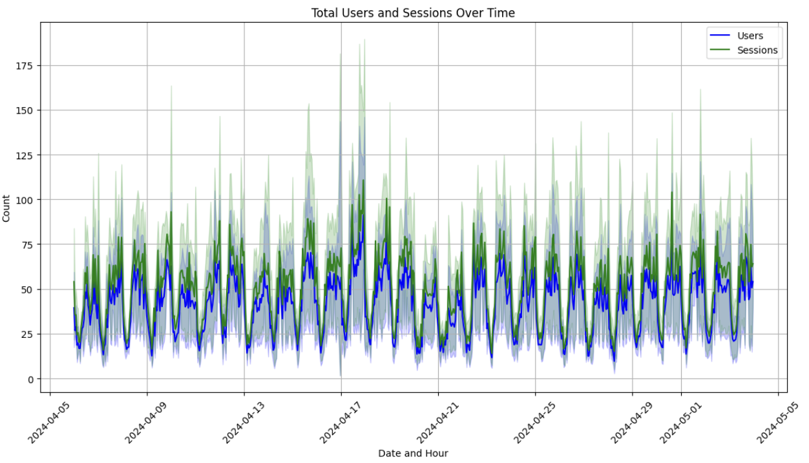
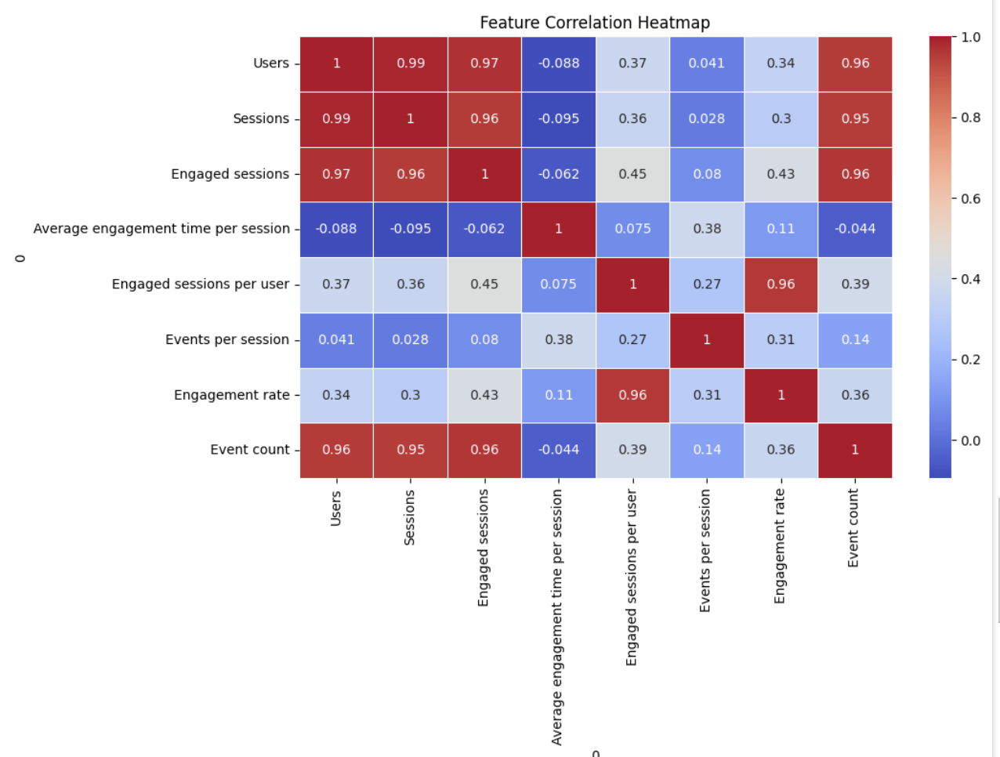
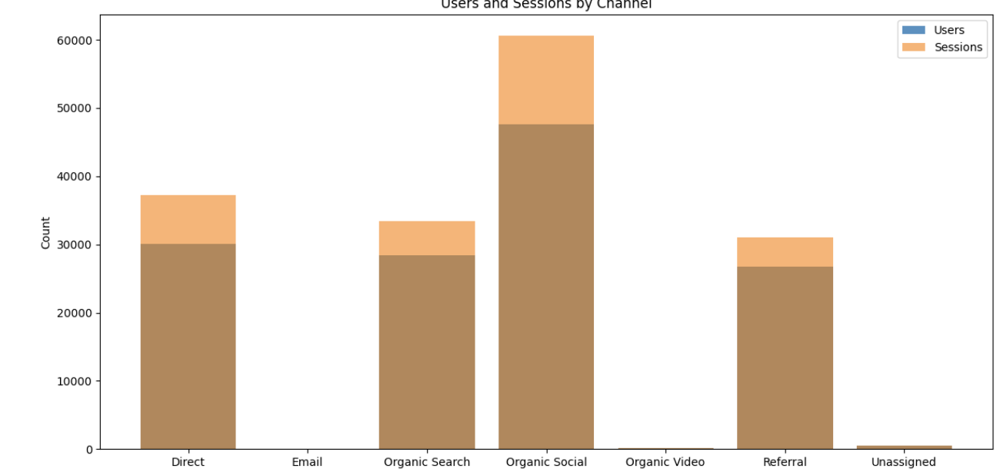
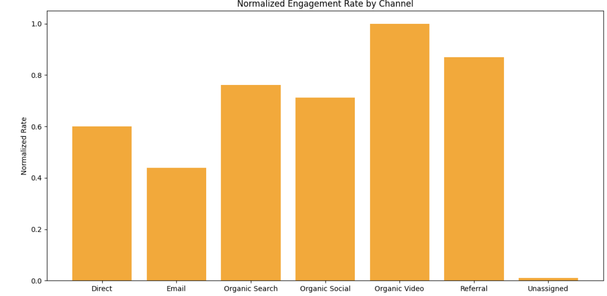
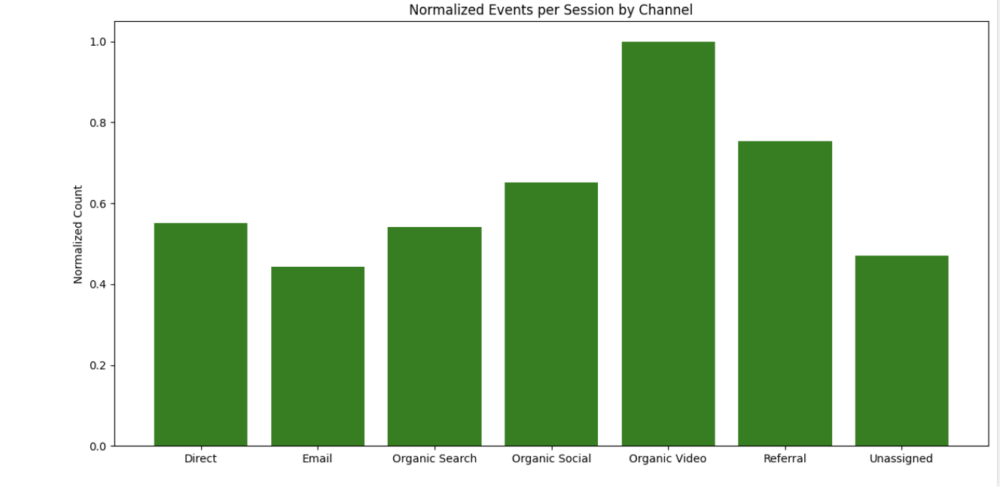

# 📊 Performance Analysis: User Engagement & Traffic Insights

## 📌 Project Overview
This project analyzes **user engagement, traffic sources, and session trends** using **data visualization and machine learning**. By leveraging **advanced analytics**, we uncover valuable insights into how users interact with a platform and what drives engagement across different traffic channels.

## 🚀 Key Features
- 📈 **Time-series analysis** of user sessions and engagement patterns.
- 🔥 **Correlation heatmap** to identify the strongest influencing factors.
- 🎯 **Traffic source breakdown** to assess the effectiveness of marketing channels.
- 🤖 **Predictive modeling** to forecast user activity and engagement.
- 🛠 **Actionable insights** to optimize content strategy and user retention.

## 📂 Dataset Details
The dataset includes session-based user activity data with the following key features:

| **Feature** | **Description** |
|------------|---------------|
| `Date + hour (YYYYMMDDHH)` | Timestamp of user activity |
| `Users` | Unique visitors in that session |
| `Sessions` | Total browsing sessions recorded |
| `Engaged sessions` | Sessions where users actively interacted |
| `Average engagement time per session` | Time spent per session (seconds) |
| `Engaged sessions per user` | Ratio of engaged sessions per user |
| `Events per session` | Average number of interactions per session |
| `Engagement rate` | Percentage of engaged sessions |
| `Traffic Source (Primary Channel Group)` | How users arrived (e.g., Direct, Organic Social, Email) |

---

## 📊 Insights from Visualizations

### **1️⃣ Users and Sessions Over Time**

🔍 **Key Takeaways:**
- **Cyclical spikes** suggest peak activity periods, possibly tied to user habits or scheduled promotions.
- **High-traffic periods** could indicate successful marketing efforts or trending content.
- **Sharp peaks** may reveal viral content or high-impact campaigns.

✅ **Actions:**
- Schedule content releases during peak engagement hours.
- Identify patterns that cause major spikes and replicate them.
- Optimize infrastructure for heavy-traffic periods to prevent slowdowns.

---

### **2️⃣ Feature Correlation Heatmap**

🔍 **Key Takeaways:**
- **Users and Sessions are almost perfectly correlated** (0.99), meaning user acquisition directly impacts total session volume.
- **Engagement rate correlates with Engaged Sessions per User (0.43)**, showing that deeper interactions matter more than pure traffic.
- **Event count strongly correlates with Users (0.96)**, suggesting that user volume drives interaction rates.

✅ **Actions:**
- Focus on improving session depth rather than just increasing traffic.
- Implement interactive elements (polls, videos, quizzes) to boost engagement.
- Use A/B testing to optimize factors influencing session duration.

---

### **3️⃣ Users and Sessions by Traffic Channel**

🔍 **Key Takeaways:**
- **Organic Social is the dominant traffic source**, driving the highest user engagement.
- **Direct traffic is strong**, suggesting a loyal returning audience.
- **Email and Referral sources are underperforming**, requiring improvement.

✅ **Actions:**
- Maximize Organic Social’s reach with high-performing content.
- Optimize Direct traffic engagement by creating personalized experiences.
- Rethink email campaigns—A/B test subject lines and interactive elements.

---

### **4️⃣ Engagement Rate by Traffic Source**

🔍 **Key Takeaways:**
- **Organic Video leads engagement**, proving that video content is highly effective.
- **Referral traffic has high engagement**, indicating strong intent from referred users.
- **Email engagement is low**, meaning outreach campaigns need improvement.

✅ **Actions:**
- Double down on video content for better engagement.
- Strengthen referral partnerships to attract high-intent visitors.
- Improve email personalization strategies to boost user interest.

---

### **5️⃣ Events Per Session by Channel**

🔍 **Key Takeaways:**
- **Organic Video drives the most interactions per session**, reinforcing its role in engagement.
- **Referral traffic users tend to interact more**, suggesting external visitors are more engaged.
- **Email performs poorly**, aligning with its low engagement rate.

✅ **Actions:**
- Expand video-based engagement strategies to maximize user participation.
- Enhance referral campaigns with exclusive incentives.
- Redesign email CTAs to encourage more meaningful interactions.

---
